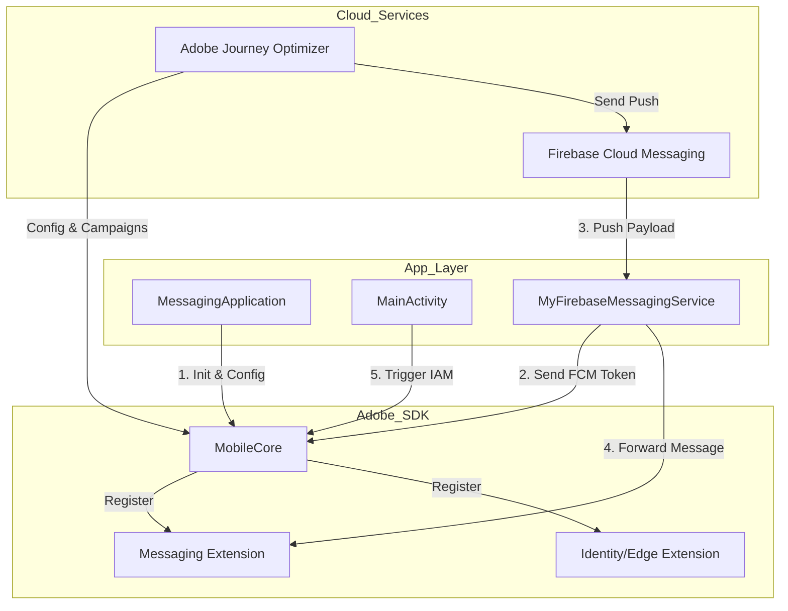

# Adobe Journey Optimizer (AJO) - Android Implementation Template

Este proyecto es una implementación de referencia para integrar el SDK de Adobe Experience Platform (AEP) con enfoque en **Adobe Journey Optimizer (AJO)**. Permite la gestión de notificaciones Push, mensajes In-App y medición de experiencias basadas en datos.

---

## 🏗️ Arquitectura y Flujo de Datos

El siguiente diagrama muestra cómo interactúan las clases principales con los servicios de Firebase y Adobe:



---

## 🐳 Docker: Compilación y Distribución Ligera

Hemos optimizado el Dockerfile para que sea rápido y ligero, funcionando como un servidor de distribución de APKs.

### 1. Requisitos Previos
Asegúrate de tener configurado tu archivo `.env.local` en la raíz del proyecto. El proceso de construcción de Docker lo usará para generar automáticamente el `google-services.json` válido.

### 2. Construir la Imagen (Build)
Este comando compila el proyecto Android internamente:
```bash
docker build -t ajo-apk-dist .
```

### 3. Ejecutar el Servidor de Descarga (Run)
Levanta un servidor web minimalista que expone el APK compilado:
```bash
docker run -d -p 8080:80 --name ajo-apk-server ajo-apk-dist
```

### 4. Obtener el APK
Una vez que el contenedor esté corriendo, puedes obtener el archivo de dos formas:
*   **Vía Navegador:** Entra en [http://localhost:8080/app-debug.apk](http://localhost:8080/app-debug.apk)
*   **Vía Terminal (Copia directa):**
    ```bash
    docker cp ajo-apk-server:/usr/share/nginx/html/app-debug.apk ./ajo-app.apk
    ```

---

## 📱 Componentes Principales

### 1. `MessagingApplication` (Punto de Entrada)
- **`MobileCore.configureWithAppID`**: Descarga la configuración dinámica desde Adobe Launch usando el ID definido en `.env.local`.
- **Registro de Extensiones**: Activa `Messaging`, `Identity`, `Edge` y `Assurance`.

### 2. `MyFirebaseMessagingService` (Puente Firebase)
- **`onNewToken()`**: Sincroniza el FCM Token con Adobe mediante `MobileCore.setPushIdentifier(token)`.
- **`onMessageReceived()`**: Entrega el payload de Adobe al SDK para su procesamiento y visualización.

### 3. `MainActivity` (Interacción y Tracking)
- **`MobileCore.trackAction()`**: Disparador de eventos para mensajes In-App.
- **Manejo de Intents**: Se encarga de capturar el clic en la notificación para enviar las métricas de "Apertura" a Adobe.

---

## 🔍 Análisis del Intercambio de Datos (JSON)

### 1. Flujo de Notificaciones Push (AJO Push)
1. **Registro:** La App recibe el token de Firebase.
2. **Sincronización:** Se envía el token a Adobe mediante un evento XDM.
3. **Envío:** AJO envía un JSON a Firebase con campos como `adb_title`, `adb_body`, `adb_m_id` (ID de tracking) y `adb_uri` (Deeplink).
4. **Procesamiento:** El SDK de Adobe intercepta este JSON y construye la notificación nativa.

### 2. Flujo de Mensajes In-App (AJO In-App)
*No utiliza Firebase.*
1. **Descarga:** El SDK descarga periódicamente las "Reglas de Consecuencia" en formato JSON.
2. **Trigger:** Al detectar un `trackAction` que coincida con una regla, el SDK renderiza el HTML/CSS contenido en el JSON dentro de un WebView.

**Ejemplo de Payload In-App:**
```json
{
  "rules": [{
    "condition": { "type": "matcher", "key": "action", "value": "demo_event" },
    "consequences": [{
      "type": "cjmiam",
      "detail": {
        "html": "<html>...</html>",
        "mobileParameters": { "uiTakeover": true }
      }
    }]
  }]
}
```

---

## 💡 Notas de Implementación y Troubleshooting

*   **Generación de Google Services:** El proyecto usa un script en `settings.gradle.kts` que extrae el JSON del `.env.local` antes de iniciar la compilación, garantizando que Docker y el CI de GitHub siempre tengan un archivo válido.
*   **Simulación Local:** Puedes usar el botón "Custom Demo" en la App para ver un mensaje In-App sin necesidad de configurar una campaña real en Adobe Journey Optimizer.
*   **Logs:** Filtra por `Adobe` o `AJO` en el Logcat para ver el rastro de los eventos enviados y recibidos.
