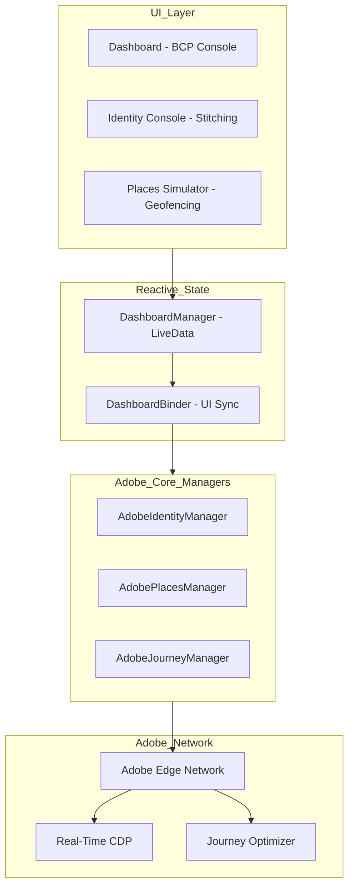

# AJO Lab Martech Engineer BCP CRM

Plataforma de referencia **Enterprise** para la implementación, validación y auditoría del ecosistema Adobe Martech: **Adobe Experience Platform (AEP)**, **Real-Time CDP**, **Adobe Journey Optimizer (AJO)** y **Adobe Places**.

---

## 🏗️ Arquitectura MVVM Enterprise (AEP + CDP + AJO)

La aplicación implementa un patrón **Clean Architecture** con una capa de datos reactiva que permite monitorear la salud de los servicios de Adobe en tiempo real.



---

## 🐳 Ejecución Local con Docker

Distribución ligera del APK mediante servidor Nginx integrado.

### 1. Construir la Imagen
```bash
docker build -t ajo-martech-app .
```

### 2. Levantar el Servidor de Descarga
```bash
docker run -d -p 8080:80 --name ajo-container ajo-martech-app
```

### 3. Obtener el Instalador
Abre en tu navegador: **[http://localhost:8080/app-debug.apk](http://localhost:8080/app-debug.apk)**

---

## 📊 Monitoreo de Estatus en Tiempo Real

El Dashboard refleja la salud de la plataforma mediante un sistema de observadores:

- 🟢 **Connected / Ready:** El servicio está sincronizado y listo para enviar/recibir eventos.
- 🟠 **Waiting:** El SDK local está activo pero la conexión con la Edge Network está pendiente o bloqueada (ej. `Missing ConfigId`).
- 🔴 **Disconnected:** Error de red o falta de configuración en `.env.local`.

---

## 🔗 Validación de Identidad (Identity Stitching)

Para validar que los eventos se vinculan correctamente en la Sandbox de Adobe:

1.  **ECID (Identidad Anónima):** `54297054263845650175479419256683523794`.
2.  **CustomerID (Identidad Conocida):** Registrar `joffre123456789` (Namespace `CRM`).
3.  **Resultado:** Al pulsar **ASOCIAR**, CDP realiza el **Profile Stitching**, unificando los eventos de navegación con el perfil real de Joffre.

---

## 📍 Evidencia de Conexión: Adobe Places

Confirmación de éxito en la integración de geolocalización:

- **Logs de Éxito:** 
  `Places/PlacesDispatcher - dispatchNearbyPlaces - Dispatching nearby places response event with 10 POIs`.
- **Acción:** Al pulsar **BCP SAN ISIDRO**, la app dispara un evento de ubicación XDM que activa Journeys en AJO basados en la presencia física del cliente.

---

## 📲 Configuración del Canal Push (AJO)

Configuración requerida en la **App Surface** de Adobe:

| Campo | Valor Enterprise Requerido |
| :--- | :--- |
| **App ID** | `com.adobe.marketing.mobile.messagingsample` |
| **Push Credentials** | Usar JSON de **Service Account** (Firebase Admin SDK) |
| **Channel ID** | `bcp_push_channel` (Configurar en el mensaje de AJO) |
| **Sound** | `sonomarca` (Habilitado para alertas corporativas) |

---

## ⚠️ Resolución del Error: `Missing edge.configId`

Si el estatus de **Journey** permanece en "Waiting", se debe publicar la configuración en Adobe Launch:

1.  **Librería:** Crea una biblioteca en **Publishing Flow**.
2.  **Recursos:** Pulsa **"Add All Changed Resources"** para incluir la extensión **Edge Network**.
3.  **Entorno:** Selecciona el entorno de **Development**.
4.  **Compilar:** Pulsa **Save & Build to Development**.

---

## 🔍 Estructura del Esquema XDM Corporativo (_bcp)

JSON estructurado enviado a Adobe Edge para activar automatizaciones:

```json
{
  "_bcp": {
    "identity": { "customerId": "joffre123456789" },
    "event": { "name": "mobile.action.interaction" },
    "mobile": {
      "action": {
        "group": "ProductListLayout",
        "category": "BCPProductList.Loans",
        "label": "POI Entry: BCP San Isidro"
      }
    }
  }
}
```
